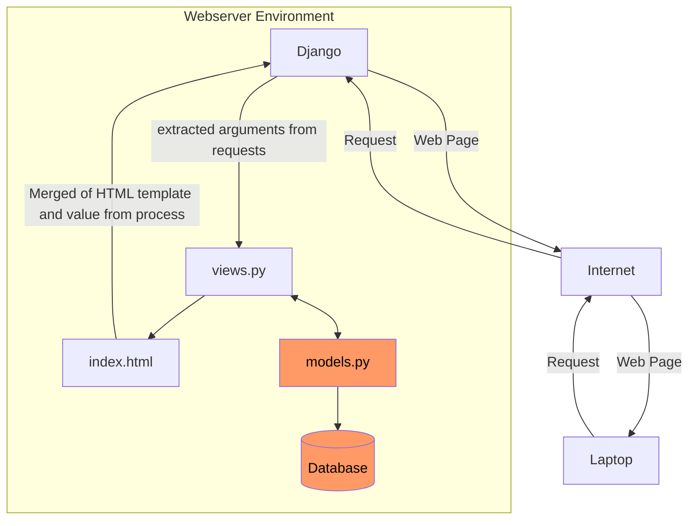

# Chicken Daddy

Link: http://christian-raphael-chickendaddy.pbp.cs.ui.ac.id

<h1>Tugas Individu</h1>
<details>
    <summary><h2>Tugas Individu 2</h2></summary>

## Jelaskan bagaimana cara kamu mengimplementasikan checklist di atas secara step-by-step (bukan hanya sekadar mengikuti tutorial).

### Membuat sebuah proyek Django baru

- Jalankan perintah berikut:

```shell
# MEBUAT DIREKTORI
mkdir chickendaddy
cd chickendaddy

# MEMBUAT ENVIRONMENT
python -m venv env

# INSTALL LIBRARIES
env\Script\activate
pip install django
pip install gunicorn
pip install whitenoise
pip install psycopg2-binary
pip install requests
pip install urllib3
pip freeze > requirements.txt
```

- Membuat `.gitignore`
- Membuat project

```
django-admin startproject chickendaddy .
```

### Membuat aplikasi dengan nama `main` pada proyek tersebut.

```
django-admin startapp main
```

Kemudian, menambahkan `ALLOWED_HOST` dalam `settings.py` agar dapat di _run_ secara lokal

```py
ALLOWED_HOSTS = ["127.0.0.1", "localhost"]
```

### Melakukan routing pada proyek agar dapat menjalankan aplikasi main.

- Menambahkan `main` pada `INSTALLED_APPS` dalam `settings.py`

```py
INSTALLED_APPS = [
...
'main'
]
```

### Membuat model pada aplikasi main dengan nama Product dan memiliki atribut wajib sebagai berikut: nama, price, description

Memodifikasi file `models.py`

```py
from django.db import models

# MENAMBAHKAN KODE DIBAWAH
class Product(models.Model):
    name = models.CharField(max_length=255)
    price = models.IntegerField()
    description = models.TextField()

    def __str__(self):
        return self.name
```

### Membuat sebuah fungsi pada `views.py` untuk dikembalikan ke dalam sebuah template HTML yang menampilkan nama aplikasi serta nama dan kelas kamu.

Memodifikasi `views.py`

```py
from django.shortcuts import render

# Create your views here.

def show_main(request):
    context = {
        'app': 'Chicken-Daddy'
        'name': 'Christian Raphael Heryanto',
        'class': 'PBP D'
    }

    return render(request, "main.html", context)
```

dan pada HTML menggunakan templating '{{}}'

```HTML
<html>
    <head>
        <meta charset="utf-8">
        <meta http-equiv="X-UA-Compatible" content="IE=edge">
        <title></title>
        <meta name="description" content="">
        <meta name="viewport" content="width=device-width, initial-scale=1">
        <link rel="stylesheet" href="">
    </head>
    <body>

        <h1>Welcome to {{ app }}!</h1>
        <p>{{ name }} | {{ class }}</p>

        <script src="" async defer></script>
    </body>
</html>
```

### Membuat sebuah routing pada `urls.py` aplikasi main untuk memetakan fungsi yang telah dibuat pada `views.py`.

- Modifikasi `urls.py` pada direktori `main`

```py
from django.urls import path
from main.views import show_main

app_name = 'main'

urlpatterns = [
    path('', show_main, name='show_main'),
]
```

- Modifikasi `urls.py` pada direktori proyek

```py
from django.contrib import admin
from django.urls import path,include

urlpatterns = [
    path('admin/', admin.site.urls),
    path('', include('main.urls')),
]
```

### Melakukan deployment ke PWS terhadap aplikasi yang sudah dibuat sehingga nantinya dapat diakses oleh teman-temanmu melalui Internet.

- Kembali ke `settings.py`, menambahkan link sesuai format pws

```py
ALLOWED_HOSTS = ["127.0.0.1", "localhost", "christian-raphael-chickendaddy.pbp.cs.ui.ac.id"]
```

- Menjalankan perintah berikut

```shell
git remote add origin https://github.com/papaChick/chickendaddy.git
git remote add pws http://pbp.cs.ui.ac.id/christian.raphael/chickendaddy
git add .
git commit -m "init commit"
git branch -M main
git push -u origin main
git branch -M master
git push pws master
```

## Buatlah bagan yang berisi request client ke web aplikasi berbasis Django beserta responnya dan jelaskan pada bagan tersebut kaitan antara urls.py, views.py, models.py, dan berkas html.



_User_ mengirim _request_ melalui Internet, yang diterima oleh Django. Django memprosesnya di `views.py` dan, jika diperlukan, mengambil data dari `models.py` yang terhubung ke database. Lalu, data teresebut _merge_ dengan template HTML. Hasilnya, halaman web yang sudah terisi data dikirim kembali melalui Internet untuk ditampilkan di browser _user_.

## Jelaskan fungsi git dalam pengembangan perangkat lunak!

Git memiliki peran yang penting dalam pengembangan perangkat lunak. Git memungkinkan kolaborasi antar developer dan pengelolaan kode. Melalui Git kita juga mampu untuk mengembangkan perangkat lunak lebih teratur sebab git merupakan sebuah _version control_, yaitu praktik melacak dan mengelola perubahan pada kode perangkat lunak.

## Menurut Anda, dari semua framework yang ada, mengapa framework Django dijadikan permulaan pembelajaran pengembangan perangkat lunak?

Django merupakan sebuah framework dalam bahasa pemrograman Python. Python dikenal sebagai bahasa pemrograman yang _beginner-friendly_. Namun, Django bukan framework satu-satunya yang menggunakan Python. Keunggulan Django dibandingkan framework-framework python lainnya adalah bahwa Django merupakan framework yang memiliki skalabilitas tinggi, mendukung pengembangan cepat, memiliki struktur yang jelas, dan dibuat dengan mempertimbangan pertahanan.

## Mengapa model pada Django disebut sebagai ORM?

Model pada Django disebut sebagai ORM (Object Relational Model) sebab Django menghubungkan objek-objek model dan tabel di relational database.

</details>

<details>
    <summary><h2>Tugas Individu 3</h2></summary>

## Jelaskan mengapa kita memerlukan data delivery dalam pengimplementasian sebuah platform?

Platform dirancang untuk mengolah data. Tanpa pengimplementasian data delivery, platform tidak dapat berjalan secara maksimal dan memenuhi tujuannya. Data delivery sendiri juga harus diperhatikan kualitasnya agar dapat menyampaikan data dengan akurat dan cepat untuk menjamin pengalaman pengguna dan integritas data yang digunakan.

<br />

## Menurutmu, mana yang lebih baik antara XML dan JSON? Mengapa JSON lebih populer dibandingkan XML?

XML (eXtensible Markup Language) & JSON (JavaScript Object Notation) memiliki keunggulannya masing-masing. XML lebih efisien dalam menyimpan data yang lebih kompleks. Walau demikian, XML memiliki readability yang lebih rendah dikarenakan mengharuskan penggunaan end tags. disisi yang lain, JSON tidak menggunakan tags sehingga lebih sederhana dan readable bagi manusia. Seperti kasus kepopuleran bahasa pemrograman Python, JSON memiliki popularitas yang tinggi sebab orang-orang cenderung memilih readibility dibandingkan efisiensi.

_XML_

```XML
<person>
  <name>John</name>
  <age>30</age>
</person>
```

_JSON_

```JSON
{
  "name": "John",
  "age": 30
}
```

<br />

## Jelaskan fungsi dari method `is_valid()` pada form Django dan mengapa kita membutuhkan method tersebut?

Method `is_valid()` pada Forms digunakan untuk melakukan validasi terhadap data yang dikirimkan. Melalui validasi, developer mengurangi beberapa tahap untuk menjaga keberlangsungan web, diantaranya validasi error dan data cleaning (Proses memperbaiki/menghilangkan data-data yang salah).

<br />

## Mengapa kita membutuhkan `csrf_token` saat membuat form di Django? Apa yang dapat terjadi jika kita tidak menambahkan `csrf_token` pada form Django? Bagaimana hal tersebut dapat dimanfaatkan oleh penyerang?

CSRF (Cross-site Request Forgery) Token digenerate secara random dan di _assign_ kepada tiap _user session_. Tujuan dari CSRF Token sendiri adalah untuk mencegah serangan CSRF terhadap platform. Untuk setiap form yang dikirimkan, Django akan memeriksa apakah token yang dikirimkan sesuai dengan token yang ada dalam _user session_.

Jika `csrf_token` tidak diimplementasikan dalam form django, penyerang dapat memanfaatkan pengguna yang sudah login dan mengirimkan permintaan ke server tanpa pengetahuan pengguna. Sebagai contoh, penyerang dapat membuat halaman palsu yang secara otomatis mengirimkan _POST request_ kepada server. Ketika pengguna mengunjungi halaman tersebut, server akan memproses permintaan seakan-akan permintaan tersebut berasal dari pengguna.

<br />


## Jelaskan bagaimana cara kamu mengimplementasikan checklist di atas secara step-by-step (bukan hanya sekadar mengikuti tutorial).

Disclaimer: Direktori saat ini (".") adalah ROOT

### Membuat template general, `./templates/base.html`

```HTML

<!DOCTYPE html>
<html lang="en">
  <head>
    <meta charset="UTF-8" />
    <meta name="viewport" content="width=device-width, initial-scale=1.0" />
     
  </head>

  <body>
     
  </body>
</html>
```

Notes:

-  - Django Template Tags

Papda tahap ini kita membuat template seperti diatas. `` (baris) bertanggung jawab untuk menggunakan static files (e.g. images, JavaScript, CSS).   (baris 7) dan   akan mensubsitusi baris tersebut dengan data yang meng-_extend_ file `./templates/base.html`

### Mengubah `./chickendaddy/settings.py` untuk membuat _base_ direktori pada direktori `./templates`

```py
TEMPLATES = [
    {
        'BACKEND': 'django.template.backends.django.DjangoTemplates',
        'DIRS': [BASE_DIR / 'templates'], # Tambahkan konten baris ini
        'APP_DIRS': True,
        ...
    }
]
```

Untuk kemudahan dan tidak perlu untuk memasukkan _full path_ dari `templates`, kita dapat mendeskripsikan **DIRS**. DIRS mendefinisikan _list_ direktori dimana Django harus mencari _template_. Kita ingin Django mencari _template_ pada direktori `templates` yang terletak pada ROOT directory. Maka, kita memasukkan:

```py
'DIRS': [BASE_DIR / 'templates']
```

Kode diatas menggunakan fitur dari modul `pathlib`. Operator `/` menggabungkan `BASE_DIR` dengan subdirektori `templates` dimana `BASE_DIR` merupakan sebuah _constant_ yang berisi path ke direktori ROOT, sehingga `BASE_DIR / 'templates'` adalah _full path_ yang mengarah pada `./templates`.

### Mengubah kode berikut dalam `./main/templates/main.html` sebagai berikut:

```HTML


<h1>Welcome to {{ app }}!</h1>
<p>{{ name }} | {{ class }}</p>


<p>Belum ada data pada database products.</p>

<table>
  <tr>
    <th>Product Name</th>
    <th>Price</th>
    <th>Description</th>
  </tr>

  
  <tr>
    <td>{{product.name}}</td>
    <td>{{product.price}}</td>
    <td>{{product.description}}</td>
  </tr>
  
</table>


<br />

<a href="">
  <button>Add Product Entry</button>
</a>

```

Notes:

- {{ … }} - Django variables
-  - Django tags

`` (baris 1) mengindikasikan bahwa template yang digunakan adalah `base.html`, dimana block-block yang dibuat pada berkas tersebut mengsubstitusi block yang ada dalam `base.html`

### Membuat berkas baru yaitu `./main/forms.py`

```py
from django.forms import ModelForm
from main.models import Product

class ProductForm(ModelForm):
    class Meta:
        model = Product
        fields = ['name', 'price', 'description']
```

`ProductForms` _inherit_ kelas `ModelForm`. Atribut-atribut yang dimasukkan kedalam fields adalah atribut yang membutuhkan input dari pengguna dalam forms.

### Membuat halaman forms dengan membuat berkas `./main/templates/create_product_entry.html`

```py


<h1>Add New Product</h1>

<form method="POST">
  
  <table>
    {{ form.as_table }}
    <tr>
      <td></td>
      <td>
        <input type="submit" value="Add Product Entry" />
      </td>
    </tr>
  </table>
</form>


```

Disini digunakan `csrf_token` untuk mencegah serangan Cross Site Request Forgery. `form.as_table` akan menunjukkan forms yang dikirim dalam context dari `views.py`

### Mengubah isi dari `views.py`

```py
from django.shortcuts import render, redirect
from main.forms import ProductForm
from main.models import Product
from django.http import HttpResponse
from django.core import serializers

# Create your views here.

def show_main(request):
    product_entries = Product.objects.all()

    context = {
        'app' : 'Chicken-Daddy',
        'name': 'Christian Raphael Heryanto',
        'class': 'PBP D',
        'products': product_entries
    }

    return render(request, "main.html", context)

def create_product_entry(request):
    form = ProductForm(request.POST or None) # Jika bukan POST request, kembalikan None

    if form.is_valid() and request.method == "POST": # Memastikan data yang dikirimkan valid
        form.save()
        return redirect('main:show_main') # Kembali ke main

    context = {'form' : form}
    return render(request, "create_product_entry.html", context)

def show_xml(request):
    data = Product.objects.all()
    return HttpResponse(serializers.serialize("xml", data), content_type="application/xml")

def show_json(request):
    data = Product.objects.all()
    return HttpResponse(serializers.serialize("json", data), content_type="application/json")

def show_xml_by_id(request, id):
    data = Product.objects.filter(pk=id)
    return HttpResponse(serializers.serialize("xml", data), content_type="application/xml")

def show_json_by_id(request, id):
    data = Product.objects.filter(pk=id)
    return HttpResponse(serializers.seriali
```

`create_product_entry` hanya menerima POST _request_. Setiap _method_ yang dibuat dalam `views.py` mengambil _objects_ model `Products` yang telah dibuat dari database, sehingga membutuhkan `Product.objects`. _Method_ `show_xml`, `show_json`, `show_xml_by_id`, dan `show_json_by_id` membutuhkan _serializer_ untuk mengubah data menjadi format tertentu (JSON & XML).

### Mengubah `./main/urls.py`

```py
from django.urls import path
from main.views import show_main, create_product_entry, show_xml, show_json, show_xml_by_id, show_json_by_id


app_name = 'main'

urlpatterns = [
    path('', show_main, name='show_main'),
    path('create-product-entry', create_product_entry, name='create_product_entry'),
    path('xml/', show_xml, name='show_xml'),
    path('json/', show_json, name='show_json'),
    path('xml/<str:id>', show_xml_by_id, name='show_xml_by_id'),
    path('json/<str:id>', show_json_by_id, name='show_json_by_id'),
]
```

Pada langkah ini, dibuat URL (Unicode Resource Locator) untuk setiap _method_ yang terdapat dalam `views.py`, kita buat _url patterns_. Hal tersebut dilakukan agar setiap _method_ pada `views.py` dapat di akses melalui URL.


</details>

<details>
    <summary><h2>Tugas Individu 4</h2></summary>

## Apa perbedaan antara `HttpResponseRedirect()` dan `redirect()`

_Method_ `HttpResponseRedirect()` hanya dapat memiliki `url` sebagai argumen pertama. Sedangkan `redirect()` akan mengembalikan `HttpResponseRedirect` yang mampu menerima argumen menerima `model`, `view`, or `url`.

Sumber:

- https://docs.djangoproject.com/en/5.1/topics/http/shortcuts/
- https://docs.djangoproject.com/en/5.1/ref/request-response/#django.http.HttpResponseRedirect

## Jelaskan cara kerja penghubungan model `MoodEntry` dengan `User`!

`MoodEntry` diberikan attribute ForeignKey `User`, sehingga terbuat hubungan _Many-to-one_. `User` disini adalah models _package_ `django.contrib.auth.models`. Untuk melakukan _filtering_ pada object `MoodEntry`, cukup menambahkan kode berikut pada _models_:

```py
class MoodEntry(models.Model):
    user = models.ForeignKey(User, on_delete=models.CASCADE)
```

Sumber:

- https://docs.djangoproject.com/en/4.2/topics/db/examples/many_to_one/

## Apa perbedaan antara authentication dan authorization, apakah yang dilakukan saat pengguna login? Jelaskan bagaimana Django mengimplementasikan kedua konsep tersebut.

_Authentication_ adalah proses verifikasi identitas seorang _user_, sedangkan _Authorization_ adalah proses verifikasi hak akses seorang _user_. Django mengimplementasikan kedua konsep ini dengan cara yang berbeda. _Authentication_ pada Django diimplementasikan melalui `User` _models_ dan _method_ `login`, `logout`, `authenticate` bawaan django. _Authorization_ pada Django diimplementasikan melalui _decorators_ seperti `login_required()` yang bertujuan untuk membatasi akses _user_ hanya untuk yang terautentikasi.

## Bagaimana Django mengingat pengguna yang telah login? Jelaskan kegunaan lain dari cookies dan apakah semua cookies aman digunakan?

Django mengingat pengguna yang telah login melalui _Cookies_ dan _Session_. _Cookies_ merupakan data yang diassign pada _browser user_.

Saat register, _server_ akan menyimpan `SESSION ID` dan mengassignnya kepada _browser user_ dalam bentuk _Cookies_. Kemudian, _user_ yang telah login akan memiliki _Cookie_ tersebut dalam browser. Selama _Cookie_ masih berada dalam _browser_ (belum expire atau logout), setiap request akan mengandung _Cookie_ tersebut. Lalu, _Cookie_ diterima _server_ dan akan dilakukan _lookup_ terhadap `SESSION ID` yang terkandung. Jika valid, maka akan dianggap login. Saat _user_ logout, _Cookies_ akan dihapus dari _browser user_, namun tetap tersimpan dalam _server_.


Terdapat beberapa kegunaan lain untuk cookies, yaitu:

- Menyimpan Preferensi _User_
- Melacak Aktivitas _User_
- Fitur 'Remember Me' pada login

Walau demikian, tidak semua _cookies_ aman digunakan. Contohnya adalah _cookies_ yang tidak diberi atribut `HttpOnly`. _Cookie_ tersebut rentan terhadap serangan XSS (_Cross Site Scripting_) sebab dapat diambil menggunakan Javascript. Mungkin terdengar biasa saja, namun perlu diketahui bahwa _cookies_ dapat memberikan akses secara langsung terhadap suatu web tanpa mengharuskan seseorang untuk login terlebih dahulu. Sehingga, data-data penting dan informasi pribadi dapat diakses oleh orang yang memiliki `cookie` kita.

## Jelaskan bagaimana cara kamu mengimplementasikan checklist di atas secara step-by-step (bukan hanya sekadar mengikuti tutorial).

### Mengimplementasikan _authentication_ pada `views`

- **Menambahkan imports**
  ```py
  from django.contrib.auth.decorators import login_required
  from django.shortcuts import render, redirect
  from django.contrib.auth.forms import UserCreationForm, AuthenticationForm
  from django.contrib.auth import authenticate, login, logout
  from django.contrib import messages
  from django.http import HttpResponse, HttpResponseRedirect
  from django.core import serializers
  from django.urls import reverse
  from main.forms import ProductForm
  from main.models import Product
  import datetime
  ```
- **Menambahkan _method_ `login`, `logout`, `register`**

  ```python
  def register(request):
      form = UserCreationForm()

      if request.method == "POST":
          form = UserCreationForm(request.POST)
          if form.is_valid():    # Menyimpan data dari form jika valid
              form.save()
              messages.success(request, 'Your account has been successfully created!')
              return redirect('main:login')
      context = {'form':form}
      return render(request, 'register.html', context)

  def login_user(request):
      if request.method == 'POST':
          form = AuthenticationForm(data=request.POST)

          if form.is_valid():    # Ambil user, lalu login sebagai user
              user = form.get_user()
              login(request, user)
              response = HttpResponseRedirect(reverse("main:show_main"))
              response.set_cookie('last_login', str(datetime.datetime.now())) # Set cookie last_login
              return response

      else:
          form = AuthenticationForm(request)
      context = {'form': form}
      return render(request, 'login.html', context)


  def logout_user(request):
      logout(request)
      response = HttpResponseRedirect(reverse('main:login'))
      response.delete_cookie('last_login')
      return response
  ```

  django.contrib.auth memiliki model User yang dimana memiliki fields sebagai berikut:

  - username
  - first_name
  - last_name
  - email
  - password
  - groups
  - user_permissions
  - is_staff
  - is_active
  - is_superuser
  - last_login
  - date_joined  
    https://docs.djangoproject.com/en/5.1/ref/contrib/auth/

- **Mengganti `show_main` dan `create_product_entry` untuk menyesuaikan**

  ```py
  def show_main(request):
      product_entries = Product.objects.filter(user=request.user)    # Filter sesuai user yang memberi request

      context = {
          'app' : 'Chicken-Daddy',
          'name': request.user.username,    # Menunjukkan username user yang membuat request pada field name
          'class': 'PBP D',
          'products': product_entries,
          'last_login': request.COOKIES['last_login'],    # Menunjukkan last_login yang diambil dari cookie
      }

      return render(request, "main.html", context)

  def create_product_entry(request):
      form = ProductForm(request.POST or None)

      if form.is_valid() and request.method == "POST":
          product_entry = form.save(commit=False)    # mendapatkan model
          product_entry.user = request.user    # menambahkan data terhadap model tersebut
          product_entry.save()    # menyimpan model
          return redirect('main:show_main')

      context = {'form' : form}
      return render(request, "create_product_entry.html", context)
  ```

- **membuat templates `login.html` & `register.html`**

  ```HTML
  <!-- login.html -->
  
  
  <title>Login</title>
  

  
  <div class="login">
    <h1>Login</h1>

    <form method="POST" action="">
      
      <table>
        {{ form.as_table }}
        <tr>
          <td></td>
          <td><input class="btn login_btn" type="submit" value="Login" /></td>
        </tr>
      </table>
    </form>

    
    <ul>
      
      <li>{{ message }}</li>
      
    </ul>
     Don't have an account yet?
    <a href="">Register Now</a>
  </div>

  
  ```

  ```html
  <!-- register.html -->
   
  <title>Register</title>
   

  <div class="login">
    <h1>Register</h1>

    <form method="POST">
      
      <table>
        {{ form.as_table }}
        <tr>
          <td></td>
          <td><input type="submit" name="submit" value="Daftar" /></td>
        </tr>
      </table>
    </form>

    
    <ul>
      
      <li>{{ message }}</li>
      
    </ul>
    
  </div>

  
  ```

- **Menghubungkan `Product` dan `User` melalui `models.py`**

  ```py
  from django.db import models
  from django.contrib.auth.models import User
  import uuid

  # Create your models here.
  class Product(models.Model):
      id = models.UUIDField(primary_key=True, default=uuid.uuid4, editable=False)
      user = models.ForeignKey(User, on_delete=models.CASCADE)    # Menambah line ini
      name = models.CharField(max_length=255)
      price = models.IntegerField()
      description = models.TextField()

      def __str__(self):
          return self.name
  ```

### Authorization

Kita ingin mengharuskan user untuk login sebelum memperlihatkan home. Maka, kita gunakan decorators `@login_required` dari `django.contrib.auth.decorators`. Kita tambahkan decorators ini pada `views.py`, tepatnya pada _method_ `show_main`

```py
@login_required(login_url='/login')
def show_main(request):
...
```

### Finishing

Buat endpoints url pada `urlpatterns` di `./main/urls.py`

```py
from django.urls import path
from main.views import *


app_name = 'main'

urlpatterns = [
    path('', show_main, name='show_main'),
    path('create-product-entry', create_product_entry, name='create_product_entry'),
    path('xml/', show_xml, name='show_xml'),
    path('json/', show_json, name='show_json'),
    path('xml/<str:id>', show_xml_by_id, name='show_xml_by_id'),
    path('json/<str:id>', show_json_by_id, name='show_json_by_id'),
    path('register/', register, name='register'),
    path('login/', login_user, name='login'),
    path('logout/', logout_user, name='logout'),
]
```

</details>
<details>
    <summary><h2>Tugas Individu 5</h2></summary>
## Jika terdapat beberapa CSS selector untuk suatu elemen HTML, jelaskan urutan prioritas pengambilan CSS selector tersebut!

Dalam CSS, urutan prioritas pengambilan selector untuk suatu elemen HTML dikenal sebagai _specifity_. Urutan prioritas dari yang tertinggi ke terendah adalah sebagai berikut:

1. _Inline styles_
   Contoh: `<div style="color: red;">...</div>`
2. _ID selectors_
   Contoh: `#header { ... }`
3. _Class selectors_, _atribut selectors_, dan _pseudo-class_
   Contoh: `.highlight { ... }`, `[type="text"] { ... }`, `:hover { ... }`
4. _Element selectors_ dan _pseudo-elements_
   Contoh: `div { ... }`, `::before { ... }`
5. _Universal selector_
   Contoh: `* { ... }`
6. _Inherited styles_

Catatan Tambahan:

- Jika dua selector memiliki _specifity_ yang sama, maka _selector_ yang ditulis terakhir dalam file CSS akan digunakan.
- Penggunaan `!important` akan mengabaikan aturan spesifisitas normal. Tidak disarankan kecuali benar-benar diperlukan.
- _Proximity_ sebuah elemen terhadap elemen lain yang dirujuk oleh _CSS Selector_ tidak berpengaruh pada _specifity_

Source: [MDN web docs](https://developer.mozilla.org/en-US/docs/Web/CSS/Specificity)

## Mengapa _responsive design_ menjadi konsep yang penting dalam pengembangan aplikasi _web_? Berikan contoh aplikasi yang sudah dan belum menerapkan _responsive design_!

_Responsive design_ merupakan konsep dimana _layout_ dan _design_ dibuat untuk menyesuaikan ukuran layar _gadget_ yang berbeda, dari yang besar hingga kecil. Tujuan dari konsep ini adalah untuk memudahkan pengguna dalam menggunakan _web_ dan memuat seluruh informasi agar dapat diakses lebih mudah.

Contoh aplikasi yang sudah menerapkan _responsive design_ adalah scele.cs.ui.ac.id dan siak.ui.ac.id.
Scele memiliki _navigation bar_ yang berskala dan menyesuaikan ukuran layar. Ditambah, saat ukuran layar kecil _navigation bar_ scele menjadi _dropdown_. Perubahan tersebut memungkinkan scele untuk mencapai ukuran yang sesuai dan menyisakan ruang yang cukup luas untuk _content_ yang disajikan. Dengan demikian, scele dapat dikategorikan sebagai _web_ yang menerapkan _responsive design_.

Siak memiliki skala yang berubah sesuai dengan rasio kecilnya layar yang digunakan. Namun, tidak ada perubahan selain skala pada fitur-fitur Siak; _font semakin kecil_, _navigation bar_ semakin kecil. Hal ini tentu menyulitkan pengguna mobile sebab mereka terkena restriksi sehingga tidak dapat menggunakan siak secara maksimal. Dengan demikian, siak dapat dikategorikan sebagai _web_ yang tidak menerapkan _responsive design_, atau yang kerap disebut dengan "_unresponsive design_".

## Jelaskan perbedaan antara _margin_, _border_, dan _padding_, serta cara untuk mengimplementasikan ketiga hal tersebut!

_Margin_ merupakan jaraak antara titik terluar elemen dengan elemen-elemen lain.

```CSS
margin: 10px;                   /* Semua sisi */
margin: 5px 10px 15px 20px;     /* Atas, kanan, bawah, kiri */
margin: 10px 20px;              /* Atas-bawah, kiri-kanan */

margin-top: 10px;               /* Individu */
margin-right: 20px;
margin-bottom: 15px;
margin-left: 5px;
```

_Border_ merupakan garis yang mengelilingi konten dan _padding_ elemen

```CSS
border: 1px solid black;        /* Shorthand */

border-width: 1px;              /* Individu */
border-style: solid;
border-color:

border-top: 2px dashed red;     /* Sisi spesifik */
```

_Padding_ merupakan jarak antara titik terluar elemen dengan konten.

```CSS
padding: 10px;                  /* Semua sisi */

padding: 5px 10px 15px 20px;    /* Atas, kanan, bawah, kiri */

padding: 10px 20px;             /* Atas-bawah, kiri-kanan */

padding-top: 10px;              /* Individu */
padding-right: 20px;
padding-bottom: 15px;
padding-left: 5px;
```

## Jelaskan konsep _flex box_ dan _grid layout_ beserta kegunaannya!

_Flex box_ merupakan metode _layout_ yang mengatur elemen didalamnya dalam kolom atau baris.
Kegunaan dari _Flex box_ pada umumnya adalah sebagai berikut:

- Membuat _layout_ yang responsif dan fleksibel
- Mendistribusikan ruang di antara elemen-elemen dalam sebuah container
- Mengatur _alignment_ vertikal dengan mudah

_Grid layout_ merupakan metode _layout_ yang mengatur elemen didalamnya dalam kolom dan baris.
Kegunaan dari _Grid layour_ pada umumnya adalah sebagai berikut:

- Membuat layout kompleks dengan mudah
- Mengatur tata letak dalam baris dan kolom sekaligus

## Jelaskan bagaimana cara kamu mengimplementasikan _checklist_ di atas secara _step-by-step_ (bukan hanya sekadar mengikuti tutorial)!

### Implementasikan fungsi untuk menghapus dan mengedit product.

- **Buat _method delete_ dan _update_ pada `views.py`**

  ```python
  def edit_product(request, id):
    # Get product entry berdasarkan id
    product = Product.objects.get(pk = id)

    # Set product entry sebagai instance dari form
    form = ProductForm(request.POST or None, instance=product)

    if form.is_valid() and request.method == "POST":
        # Simpan form dan kembali ke halaman awal
        form.save()
        return HttpResponseRedirect(reverse('main:show_main'))

    context = {'form': form}
    return render(request, "edit_product.html", context)

    def delete_product(request, id):
        # Get product berdasarkan id
        product = Product.objects.get(pk = id)
        # Hapus product
        product.delete()
        # Kembali ke halaman awal
        return HttpResponseRedirect(reverse('main:show_main'))
  ```

- **Buat _template_ untuk _update_**

- **Buat `urlpattern` untuk masing-masing _method_**

### Kustomisasi desain pada template HTML

- **Menambahkan _package_ `django-widget-tweaks`**

  ```
    pip install django-widget tweaks
  ```

  _Package_ ini kedepannya akan digunakan untuk menambahkan _class_ pada _template variable_, bersifat _optional_ namun sangat membantu dalam melakukan _styling_ pada _web_.
  Tidak lupa untuk mengaktivasi env & menambahkannya ke requirements.txt.

  Tambahkan juga dalam `settings.py`:

  ```python
  ...
  INSTALLED_APPS = [
    'django.contrib.admin',
    'django.contrib.auth',
    'django.contrib.contenttypes',
    'django.contrib.sessions',
    'django.contrib.messages',
    'django.contrib.staticfiles',
    'widget_tweaks',  # Baris ini
    'main',
  ]
  ...
  ```

- **Membuat menghubungkan _Static_**
  Buat direktori `static` dengan 2 subdirektori yaitu `css` & `image`.Setelah itu masuk kedalam `setting.py` dan tambahkan baris baris berikut:

  ```python
  STATIC_URL = '/static/'
    if DEBUG:
        STATICFILES_DIRS = [
            BASE_DIR / 'static' # merujuk ke /static root project pada mode development
        ]
    else:
        STATIC_ROOT = BASE_DIR / 'static' # merujuk ke /static root project pada mode production
  ```

- **Menambahkan styles (Tailwind CSS & Google Fonts)**
  Dalam `templates/base.html`, tambahkan:
  ```HTML
  
    <!DOCTYPE html>
    <html lang="en">
      <head>
        <meta charset="UTF-8" />
        <meta name="viewport" content="width=device-width, initial-scale=1.0" />
         
         // Baris ini untuk CSS
        <script src="https://cdn.tailwindcss.com"></script>
        // Baris untuk custom Font
        <link href="https://fonts.googleapis.com/css2?family=Press+Start+2P&display=swap" rel="stylesheet">
        // Untuk menambahkan global css
        <link rel="stylesheet" href=""/>
        <script>
          tailwind.config = {
            theme: {
              extend: {
                fontFamily: {
                  'header': ['"Press Start 2P"', 'cursive'],  // Custom font
                },
              }
            }
          }
        </script>
        <style>
          .text-shadow {
                text-shadow:
                    4px 4px 0 rgba(20, 20, 20, 0.7),    /* Offset shadow further down and right */
                    3px 3px 0 rgba(0, 0, 0, 0.5),       /* Slightly less offset shadow */
                    2px 2px 0 rgba(0, 0, 0, 0.3);       /* Closer shadow for depth */
            }
      </style>
      <title> </title>
      </head>
      <body class="bg-neutral-800 text-neutral-300 font-mono">
         
      </body>
    </html>
  ```
  [!NOTE]
- Kustomisasi dilakukan dengan sekreatif mungkin menggunakan Tailwind CSS melalui `templates`
- Responsiveness dilakukan dengan `lg:`, `md:`, dan `sm:` milik Tailwind CSS dan `flex-box`
- Conditional dilakukan dengan django _template tags_ (``)
- `` diperlukan untuk memasukkan static (gambar & global.css)
- `{% load 'widget-tweaks'}` diperlukan untuk memasukkan class pada django _template variables_ (`{{ ... }}`)
- `` diperlukan untuk memasukkan navbar dari `./templates/navbar`
- Pergantian antara _Mobile menu_ dan _Desktop menu_ dilakukan dengan script dan `hidden`. _Mobile menu_ dibuat agar hanya muncul saat layar kecil.
</details>
<details open>
  <summary><h2>Tugas Individu 6</h2></summary>

## Jelaskan manfaat dari penggunaan JavaScript dalam pengembangan aplikasi web!

Javascript menambahkan logika kepada aplikasi _web_ yang dibangun. Javascript memiliki fungsi utama yaitu untuk pengembangan _frontend_. Pengaplikasian Javascript pada _frontend_ bertujuan untuk menciptakan _web_ yang bersifat _dynamic_. Selain itu, secara _general_, Javascript memungkinkan _visitor_ untuk berinteraksi dengan _web_ yang telah dibuat.

## Jelaskan fungsi dari penggunaan await ketika kita menggunakan fetch()! Apa yang akan terjadi jika kita tidak menggunakan await?

`fetch()` merupakan _asynchronous method_, yaitu _method_ yang berjalan secara paralel bersamaan dengan fungsi-fungsi yang lainnya. Namun, perlu diingat bahwa sebelum data `fetch()` dapat diproses, server harus menunggu hingga data tersebut diterima. Sehingga, dibutuhkan `await` bertugas untuk menghentikan eksekusi `async` hingga data dari `fetch()` diterima. Tanpa `await`, kode setelah `await` akan dijalankan tanpa menunggu data dari `fetch()`. Hal ini dapat menimbulkan error/bug yang tidak diinginkan sehingga **harus** menggunakan `await`.

## Mengapa kita perlu menggunakan decorator csrf_exempt pada view yang akan digunakan untuk AJAX POST?

Penggunaan `@csrf_exempt` membuat Django tidak perlu melakukan pengecekan keberadaan `csrf_token` pada `POST` _request_. Tujuan utama dari hal tersebut adalah untuk memudahkan pengimplementasian AJAX pada aplikasi _web_. Pengorbanan dari pengimplementasian AJAX yang lebih mudah adalah keretanan _web_ terhadap serangan CSRF. Menurut berbagai sumber, terdapat cara-cara yang dapat dilakukan untuk tetap mengimplentasikan `csrf_token` pada AJAX _request_ menggunakan Django. Proteksi terhadap `csrf_token` sangat dianjurkan, kecuali _developer_ yang terkait mengetahui konsekuensi yang diambil dengan meletakan `@csrf_exempt`.

Sumber: [DRF Docs: AJAX CSRF CORS](https://www.django-rest-framework.org/topics/ajax-csrf-cors/#:~:text=In%20order%20to%20make%20AJAX,described%20in%20the%20Django%20documentation.), [Django: CSRF Protection docs](https://docs.djangoproject.com/en/5.1/howto/csrf/#using-csrf-protection-with-ajax)

## Pada tutorial PBP minggu ini, pembersihan data input pengguna dilakukan di belakang (backend) juga. Mengapa hal tersebut tidak dilakukan di frontend saja?

Sebenarnya lebih baik untuk melakukan sanitasi pada kedua sisi (_frontend & backend_). Namun, jika kasusnya ingin melakukan sanitasi pada _frontend_ saja, perlu diingat bahwa data diproses pada _backend_. Apabila sanitasi hanya dilakukan pada _frontend_, sebuah penyerang dapat "menembak" request langsung kepada _backend_ menggunakan aplikasi seperti _Postman_ / _Thunder Client_ , tanpa melalui _frontend_. Kasus seperti ini dapat berakhir fatal, sehingga sangat dianjurkan untuk mengutamakan sanitasi pada _backend_.

Note:  
Sanitasi = Upaya membersihkan input data dari pengguna.

## Jelaskan bagaimana cara kamu mengimplementasikan checklist di atas secara step-by-step (bukan hanya sekadar mengikuti tutorial)!

Disclaimer:  
pada Tugas Individu 6 saya memutuskan untuk mengimplementasikan javascript secara _external_ (dan sedikit secara _embedded_ juga).

### Setup

- Buat direktori baru, `/static/js`.  
  Direktori ini akan menjadi tempat penyimpanan semua berkas Javascript (atau semua berkas yang memiliki ekstensi `.js`).

### AJAX `GET`

pada AJAX `GET`, kita akan membahas lebih banyak terkait `fetch()` API

- Ganti views.py

  - Hilangkan baris-baris berikut:

    ```python
    product = Product.objects.filter(user=request.user)
    ```

    ```python
    'product_entries': product,
    ```

    Dihilangkan sebab objek-objek _products_ akan diambil melalui enpoint `/json`.

  - Ubah baris pengambilan data pada `show_json` & `show_xml`

    ```python
    data = Product.objects.filter(user=request.user)
    ```

    Tujuannya adalah agar hanya _web_ menunjukkan data pengguna yang masuk.

  - Ganti _conditional block_ `product_entries` dengan empty div.

    ```HTML
    <div id="product_entry_cards"></div>
    ```

    div tag ini akan menjadi tempat dimana cards ditunjukkan, dan akan diupdate melalui javascript. _Conditonal block_ `product_entries` dihapus sebab dari `main:show_main` tidak memiliki attribute `product_entries` pada requestnya dan objek-objek `Product` nantinya akan diambil melalui _endpoint_ `/json`.

  - Membuat script `static/js/product_entries.js`

    ```javascript
    // This file is used to fetch the product entries from the server

    async function getProductEntries() {
      return fetch("/json").then((res) => res.json());
    }

    async function refreshProductEntries() {
      document.getElementById("product_entry_cards").innerHTML = "";
      document.getElementById("product_entry_cards").className = "";
      const productEntries = await getProductEntries();
      let htmlString = "";
      let classNameString = "";

      if (productEntries.length === 0) {
        classNameString =
          "flex flex-col items-center justify-center min-h-[24rem] p-6";
        htmlString = `
                <div class="flex flex-col items-center justify-center min-h-[24rem] p-6">
                     
                    <p class="text-center texct-gray-600 mt-4 opacity-50">No product entries found</p>
                </div>   
            `;
      } else {
        classNameString =
          "columns-1 sm:columns-2 lg:columns-2 gap-6 space-y-6 w-full";
        productEntries.forEach((item) => {
          const name = DOMPurify.sanitize(item.fields.name);
          const description = DOMPurify.sanitize(item.fields.description);
          htmlString += `
                <div
                    class="mx-auto flex flex-col items-center justify-between bg-[#303030] break-inside-avoid h-auto p-10 shadow-inner shadow-[#353535] transition-transform transform hover:scale-105"
                >
                    <p class="text-xl bold">${name}</p>
                    <p class="text-md italic">${item.fields.price}</p>
                    <p class="whitespace-nowrap text-wrap">${description}</p>
    
                    <div class="flex justify-between w-full mt-4">
                        <a
                            href="/edit-product/${item.pk}"
                            class="group relative py-2 px-4 border border-transparent text-sm font-medium text-white bg-yellow-600 hover:bg-yellow-700 focus:ring-2 focus:ring-offset-2 focus:ring-white transition duration-300"
                        >
                        Edit
                        </a>
                        <a
                            href="/delete/${item.pk}"
                            class="group relative py-2 px-4 border border-transparent text-sm font-medium text-white bg-red-600 hover:bg-red-700 focus:ring-2 focus:ring-offset-2 focus:ring-white transition duration-300"
                        >
                            Delete
                        </a>
                    </div>
                </div>
                `;
        });
      }
      document.getElementById("product_entry_cards").className =
        classNameString;
      document.getElementById("product_entry_cards").innerHTML = htmlString;
    }
    refreshProductEntries();
    ```

    DOMPurify digunakan sebagai bentuk pertahanan _web_ terhadap serangan _stored_ XSS. Petahanan tersebut tercapai melalui sanitasi data nama product & deskripsi sebab dapat berupa _malicious XSS payload_. Untuk menghubungkannya akan dijelaskan pada tahap selanjutnya.

  - Mengubah `main/templates/main.html`  
    Pada tahap ini, menghubungkan script `product_entries.js` secara _external_. Selain itu, juga menghubungkan DOMPurify untuk memastikan keamanan _web_

    ```javascript
    
      <title>Product Catalog</title>
      <script src="https://cdn.jsdelivr.net/npm/dompurify@3.1.7/dist/purify.min.js"></script> // Import DOMPurify melalui CDN
    
    ```

    ```javascript
    <script src=""></script>
    // Menghubungkan script dengan main.html
    ```

    untuk script `static/js/product_entries.js` perlu diletakkan dibawah _div tag_ paling terakhir, sebelum `` milik ``.

  ### AJAX `POST`

  - Mengganti `views.py`  
    Pada `views.py`, kita membuat _method_ yang akan membantu mengirikan AJAX `POST`

    ```python
    from django.views.decorators.csrf import csrf_exempt
    from django.views.decorators.http import require_POST
    from django.utils.html import strip_tags
    ...

    @csrf_exempt
    @require_POST
    def add_product_entry_ajax(request):
        name = strip_tags(request.POST.get("name"))
        price = request.POST.get("price")
        description = strip_tags(request.POST.get("description"))
        user = request.user

        new_product = Product(
            name=name, price=price,
            description=description,
            user=user
        )
        new_product.save()

        return HttpResponse(b"CREATED", status=201)
    ```

    `@csrf_exempt` _decorator_ digunakan untuk mempermudah implementasi AJAX pada aplikasi. Walau dianjurkan untuk menggunakan `csrf_token`, untuk tugas individu ini tidak digunakan terlebih dahulu. Hal ini dikarenakan fokus dari tugas individu ini adalah terhadap serangan XSS (_Cross-site Scripting_).  
    `@require_post` _decorator_ cukup menjelaskan dirinya sendiri, yaitu untuk merestriksi _request_ yang dapat mengakses _method_ tersebut sehingga hanya dapat mengirimkankan `POST` _request_.
    `strip_tags()` diimplementasikan sebagai bentuk pertahanan `POST` request terhadap _stored_ XSS. Dengan demikian, _input field forms_ tidak dapat menjadi _attack vector_ serangan XSS.

  - Menambah sanitasi pada `models.py`

    ```python
    from django.forms import ModelForm, Textarea
    from django.utils.html import strip_tags
    from main.models import Product

    class ProductForm(ModelForm):
        class Meta:
            model = Product
            fields = ['name', 'price', 'description']
            widgets = {
                'description': Textarea(attrs={
                    'rows': 1,
                    'style': 'resize:none; overflow:hidden;',
                    'class': 'auto-grow-textarea',
                }),
            }

        def clean_product(self):
            product = self.cleaned_data["product"]
            return strip_tags(product)

        def clean_description(self):
            description = self.cleaned_data["description"]
            return strip_tags(description)
    ```

  - Menambahkan endpoint pada `urls.py`

    ```python
    path('create-ajax', add_product_entry_ajax, name='add_product_entry_ajax'),
    ```

  - Membuat script `static/js/modal.js`

    ```javascript
    const modal = document.getElementById("crudModal");
    const modalContent = document.getElementById("crudModalContent");

    function showModal() {
      const modal = document.getElementById("crudModal");
      const modalContent = document.getElementById("crudModalContent");
      modal.classList.remove("hidden");
      setTimeout(() => {
        modalContent.classList.remove("opacity-0", "scale-95");
        modalContent.classList.add("opacity-100", "scale-100");
      }, 50);
    }

    function hideModal() {
      const modal = document.getElementById("crudModal");
      const modalContent = document.getElementById("crudModalContent");
      modalContent.classList.remove("opacity-100", "scale-100");
      modalContent.classList.add("opacity-0", "scale-95");
      setTimeout(() => {
        modal.classList.add("hidden");
      }, 150);
    }

    document
      .getElementById("cancelButton")
      .addEventListener("click", hideModal);
    document
      .getElementById("closeModalBtn")
      .addEventListener("click", hideModal);
    document
      .getElementById("productEntryForm")
      .addEventListener("submit", (e) => {
        e.preventDefault();
        addProductEntry();
      });
    ```

    - Membuat html `templates/form_add_product.html` sebagai _pop-up forms_

    ```HTML
    <div
      id="crudModal"
      tabindex="-1"
      aria-hidden="true"
      class="hidden fixed inset-0 z-50 w-full flex items-center justify-center bg-neutral-800 bg-opacity-75 overflow-x-hidden overflow-y-auto transition-opacity duration-300 ease-out"
    >
      <div
        id="crudModalContent"
        class="relative bg-neutral-800 shadow-lg w-5/6 sm:w-3/4 md:w-1/2 lg:w-1/3 mx-4 sm:mx-0 transform scale-95 opacity-0 transition-transform transition-opacity duration-300 ease-out"
      >
        <!-- Modal header -->
        <div class="flex items-center justify-between p-4 border-b rounded-t">
          <h3
            class="text-xl font-header text-md text-shadow font-semibold text-yellow-500"
          >
            ADD NEW PRODUCT ENTRY
          </h3>
          <button
            type="button"
            class="text-neutral-400 bg-transparent hover:bg-neutral-200 hover:text-neutral-900 rounded-lg text-sm p-1.5 ml-auto inline-flex items-center"
            id="closeModalBtn"
          >
            <svg
              aria-hidden="true"
              class="w-5 h-5"
              fill="currentColor"
              viewBox="0 0 20 20"
              xmlns="http://www.w3.org/2000/svg"
            >
              <path
                fill-rule="evenodd"
                d="M4.293 4.293a1 1 0 011.414 0L10 8.586l4.293-4.293a1 1 0 111.414 1.414L11.414 10l4.293 4.293a1 1 0 01-1.414 1.414L10 11.414l-4.293 4.293a1 1 0 01-1.414-1.414L8.586 10 4.293 5.707a1 1 0 010-1.414z"
                clip-rule="evenodd"
              ></path>
            </svg>
            <span class="sr-only">Close modal</span>
          </button>
        </div>
        <!-- Modal body -->
        <div class="px-6 py-4 space-y-6 form-style">
          <form id="productEntryForm">
            <div class="mb-4">
              <label for="name" class="block text-sm font-medium text-neutral-300"
                >Product</label
              >
              <input
                type="text"
                id="name"
                name="name"
                class="mt-1 block w-full border border-neutral-300 rounded-md p-2 hover:border-yellow-500"
                placeholder="Enter your Product"
                required
              />
            </div>
            <div class="mb-4">
              <label for="price" class="block text-sm font-medium text-neutral-300"
                >Price</label
              >
              <input
                type="number"
                id="price"
                name="price"
                class="mt-1 block w-full border border-neutral-300 rounded-md p-2 hover:border-yellow-500"
                required
              />
            </div>
            <div class="mb-4">
              <label
                for="description"
                class="block text-sm font-medium text-neutral-300"
                >Description</label
              >
              <textarea
                id="description"
                name="description"
                rows="3"
                class="mt-1 block w-full h-52 resize-none border border-neutral-300 rounded-md p-2 hover:border-yellow-500"
                placeholder="Describe your product"
                required
              ></textarea>
            </div>
          </form>
        </div>
        <!-- Modal footer -->
        <div
          class="flex flex-col space-y-2 md:flex-row md:space-y-0 md:space-x-2 p-6 rounded-b justify-center md:justify-end"
        >
          <button
            type="button"
            class="group relative w-full flex border-2 border-white justify-center py-2 px-4 border border-transparent text-sm font-medium text-white bg-neutral-800 hover:bg-neutral-900 focus:ring-2 focus:ring-offset-2 focus:ring-white transition duration-300"
            id="cancelButton"
          >
            Cancel
          </button>
          <button
            type="submit"
            id="submitProductEntry"
            form="productEntryForm"
            class="group relative w-full flex justify-center py-2 px-4 border border-transparent text-sm font-medium text-white bg-yellow-600 hover:bg-yellow-700 focus:ring-2 focus:ring-offset-2 focus:ring-white transition duration-300"
          >
            Save
          </button>
        </div>
      </div>
    </div>
    ```

  - Mengubah `main/templates/main.html`  
    Pada tahap ini, kita menambahkan 1 _function_ secara _embedded_, menghubungkan script `modal.js` secara _external_, dan melakukan "_include_" untuk memasukkan `form_add_product.html`.

    ```HTML
    ...
    </div>
    

    <script>
    function addProductEntry() {
      fetch("", {
        method: "POST",
        body: new FormData(document.querySelector('#productEntryForm')),
      })
      .then(response => refreshProductEntries())

      document.getElementById("productEntryForm").reset();
      document.querySelector("[data-modal-toggle='crudModal']").click();

      return false;
    }
    </script>
    <script src=""></script>
    <script src=""></script>
    
    ```

  </details>
