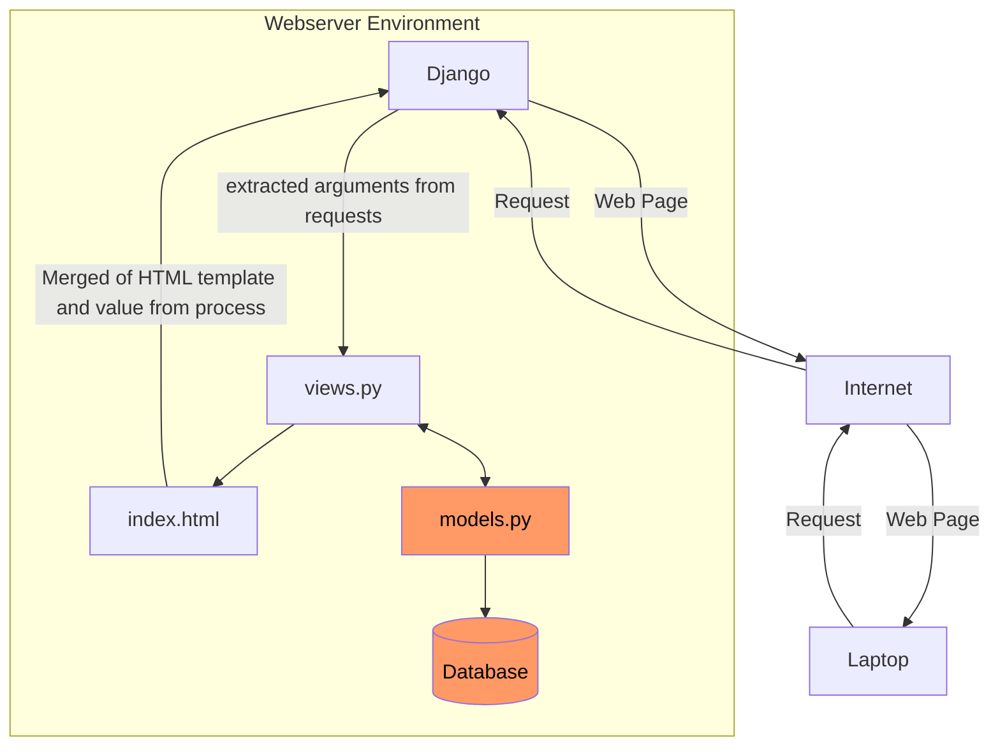

# Chicken Daddy
Link: http://christian-raphael-chickendaddy.pbp.cs.ui.ac.id
## Jelaskan bagaimana cara kamu mengimplementasikan checklist di atas secara step-by-step (bukan hanya sekadar mengikuti tutorial).

### Membuat sebuah proyek Django baru
* Jalankan perintah berikut:
```shell
# MEBUAT DIREKTORI
mkdir chickendaddy
cd chickendaddy

# MEMBUAT ENVIRONMENT
python -m venv env

# INSTALL LIBRARIES
env\Script\activate
pip install django
pip install gunicorn
pip install whitenoise
pip install psycopg2-binary
pip install requests
pip install urllib3
pip freeze > requirements.txt
```
* Membuat `.gitignore`
* Membuat project
```
django-admin startproject chickendaddy .
```

###  Membuat aplikasi dengan nama `main` pada proyek tersebut.
```
django-admin startapp main
```
Kemudian, menambahkan `ALLOWED_HOST` dalam `settings.py` agar dapat di _run_ secara lokal
```py
ALLOWED_HOSTS = ["127.0.0.1", "localhost"]
```

### Melakukan routing pada proyek agar dapat menjalankan aplikasi main.
* Menambahkan `main` pada `INSTALLED_APPS` dalam `settings.py`
```py
INSTALLED_APPS = [
...
'main'
]
```
### Membuat model pada aplikasi main dengan nama Product dan memiliki atribut wajib sebagai berikut: nama, price, description
Memodifikasi file `models.py`
```py
from django.db import models

# MENAMBAHKAN KODE DIBAWAH
class Product(models.Model):
    name = models.CharField(max_length=255)
    price = models.IntegerField()
    description = models.TextField()

    def __str__(self):
        return self.name
```

### Membuat sebuah fungsi pada `views.py` untuk dikembalikan ke dalam sebuah template HTML yang menampilkan nama aplikasi serta nama dan kelas kamu.
Memodifikasi `views.py`
```py
from django.shortcuts import render

# Create your views here.

def show_main(request):
    context = {
        'app': 'Chicken-Daddy'
        'name': 'Christian Raphael Heryanto',
        'class': 'PBP D'
    }

    return render(request, "main.html", context)
```
dan pada HTML menggunakan templating '{{}}'
```HTML
<html>
    <head>
        <meta charset="utf-8">
        <meta http-equiv="X-UA-Compatible" content="IE=edge">
        <title></title>
        <meta name="description" content="">
        <meta name="viewport" content="width=device-width, initial-scale=1">
        <link rel="stylesheet" href="">
    </head>
    <body>
        
        <h1>Welcome to {{ app }}!</h1>
        <p>{{ name }} | {{ class }}</p>

        <script src="" async defer></script>
    </body>
</html>
```
### Membuat sebuah routing pada `urls.py` aplikasi main untuk memetakan fungsi yang telah dibuat pada `views.py`.
* Modifikasi `urls.py` pada direktori `main`
```py
from django.urls import path
from main.views import show_main

app_name = 'main'

urlpatterns = [
    path('', show_main, name='show_main'),
]
```
* Modifikasi `urls.py` pada direktori proyek
```py
from django.contrib import admin
from django.urls import path,include

urlpatterns = [
    path('admin/', admin.site.urls),
    path('', include('main.urls')),
]
```

### Melakukan deployment ke PWS terhadap aplikasi yang sudah dibuat sehingga nantinya dapat diakses oleh teman-temanmu melalui Internet.
* Kembali ke `settings.py`, menambahkan link sesuai format pws
```py
ALLOWED_HOSTS = ["127.0.0.1", "localhost", "christian-raphael-chickendaddy.pbp.cs.ui.ac.id"]
```
* Menjalankan perintah berikut
```shell
git remote add origin https://github.com/papaChick/chickendaddy.git
git remote add pws http://pbp.cs.ui.ac.id/christian.raphael/chickendaddy
git add .
git commit -m "init commit"
git branch -M main
git push -u origin main
git bracnh -M master
git push pws master
```
## Buatlah bagan yang berisi request client ke web aplikasi berbasis Django beserta responnya dan jelaskan pada bagan tersebut kaitan antara urls.py, views.py, models.py, dan berkas html.


_User_ mengirim _request_ melalui Internet, yang diterima oleh Django. Django memprosesnya di `views.py` dan, jika diperlukan, mengambil data dari `models.py` yang terhubung ke database. Lalu, data teresebut _merge_ dengan template HTML. Hasilnya, halaman web yang sudah terisi data dikirim kembali melalui Internet untuk ditampilkan di browser _user_.

## Jelaskan fungsi git dalam pengembangan perangkat lunak!
Git memiliki peran yang penting dalam pengembangan perangkat lunak. Git memungkinkan kolaborasi antar developer dan pengelolaan kode. Melalui Git kita juga mampu untuk mengembangkan perangkat lunak lebih teratur sebab git merupakan sebuah _version control_, yaitu praktik melacak dan mengelola perubahan pada kode perangkat lunak. 
## Menurut Anda, dari semua framework yang ada, mengapa framework Django dijadikan permulaan pembelajaran pengembangan perangkat lunak?
Django merupakan sebuah framework dalam bahasa pemrograman Python. Python dikenal sebagai bahasa pemrograman yang _beginner-friendly_. Namun, Django bukan framework satu-satunya yang menggunakan Python. Keunggulan Django dibandingkan framework-framework python lainnya adalah bahwa Django merupakan framework yang memiliki skalabilitas tinggi, mendukung pengembangan cepat, memiliki struktur yang jelas, dan dibuat dengan mempertimbangan pertahanan.
## Mengapa model pada Django disebut sebagai ORM?
Model pada Django disebut sebagai ORM (Object Relational Model) sebab Django menghubungkan objek-objek model dan tabel di relational database.
