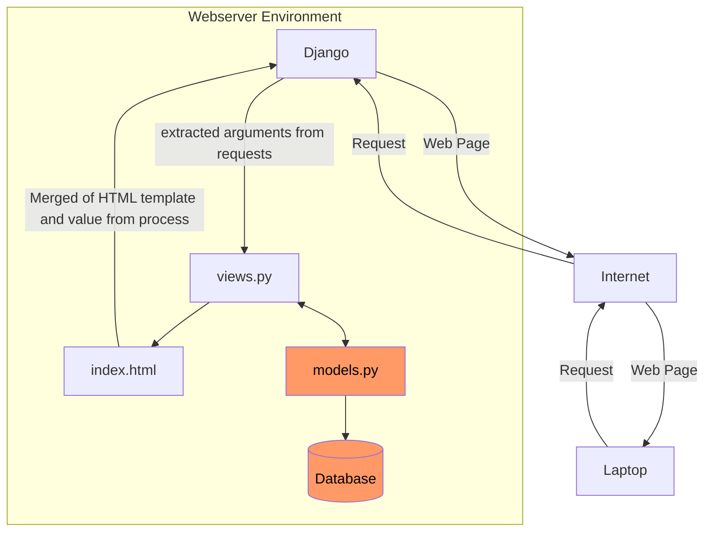

# Chicken Daddy
Link: http://christian-raphael-chickendaddy.pbp.cs.ui.ac.id

<h1>Tugas Individu</h1>
<details>
    <summary><h2>Tugas Individu 2</h2></summary>

## Jelaskan bagaimana cara kamu mengimplementasikan checklist di atas secara step-by-step (bukan hanya sekadar mengikuti tutorial).

### Membuat sebuah proyek Django baru
* Jalankan perintah berikut:
```shell
# MEBUAT DIREKTORI
mkdir chickendaddy
cd chickendaddy

# MEMBUAT ENVIRONMENT
python -m venv env

# INSTALL LIBRARIES
env\Script\activate
pip install django
pip install gunicorn
pip install whitenoise
pip install psycopg2-binary
pip install requests
pip install urllib3
pip freeze > requirements.txt
```
* Membuat `.gitignore`
* Membuat project
```
django-admin startproject chickendaddy .
```

###  Membuat aplikasi dengan nama `main` pada proyek tersebut.
```
django-admin startapp main
```
Kemudian, menambahkan `ALLOWED_HOST` dalam `settings.py` agar dapat di _run_ secara lokal
```py
ALLOWED_HOSTS = ["127.0.0.1", "localhost"]
```

### Melakukan routing pada proyek agar dapat menjalankan aplikasi main.
* Menambahkan `main` pada `INSTALLED_APPS` dalam `settings.py`
```py
INSTALLED_APPS = [
...
'main'
]
```

### Membuat model pada aplikasi main dengan nama Product dan memiliki atribut wajib sebagai berikut: nama, price, description
Memodifikasi file `models.py`
```py
from django.db import models

# MENAMBAHKAN KODE DIBAWAH
class Product(models.Model):
    name = models.CharField(max_length=255)
    price = models.IntegerField()
    description = models.TextField()

    def __str__(self):
        return self.name
```

### Membuat sebuah fungsi pada `views.py` untuk dikembalikan ke dalam sebuah template HTML yang menampilkan nama aplikasi serta nama dan kelas kamu.
Memodifikasi `views.py`
```py
from django.shortcuts import render

# Create your views here.

def show_main(request):
    context = {
        'app': 'Chicken-Daddy'
        'name': 'Christian Raphael Heryanto',
        'class': 'PBP D'
    }

    return render(request, "main.html", context)
```
dan pada HTML menggunakan templating '{{}}'
```HTML
<html>
    <head>
        <meta charset="utf-8">
        <meta http-equiv="X-UA-Compatible" content="IE=edge">
        <title></title>
        <meta name="description" content="">
        <meta name="viewport" content="width=device-width, initial-scale=1">
        <link rel="stylesheet" href="">
    </head>
    <body>
        
        <h1>Welcome to {{ app }}!</h1>
        <p>{{ name }} | {{ class }}</p>

        <script src="" async defer></script>
    </body>
</html>
```

### Membuat sebuah routing pada `urls.py` aplikasi main untuk memetakan fungsi yang telah dibuat pada `views.py`.
* Modifikasi `urls.py` pada direktori `main`
```py
from django.urls import path
from main.views import show_main

app_name = 'main'

urlpatterns = [
    path('', show_main, name='show_main'),
]
```
* Modifikasi `urls.py` pada direktori proyek
```py
from django.contrib import admin
from django.urls import path,include

urlpatterns = [
    path('admin/', admin.site.urls),
    path('', include('main.urls')),
]
```

### Melakukan deployment ke PWS terhadap aplikasi yang sudah dibuat sehingga nantinya dapat diakses oleh teman-temanmu melalui Internet.
* Kembali ke `settings.py`, menambahkan link sesuai format pws
```py
ALLOWED_HOSTS = ["127.0.0.1", "localhost", "christian-raphael-chickendaddy.pbp.cs.ui.ac.id"]
```
* Menjalankan perintah berikut
```shell
git remote add origin https://github.com/papaChick/chickendaddy.git
git remote add pws http://pbp.cs.ui.ac.id/christian.raphael/chickendaddy
git add .
git commit -m "init commit"
git branch -M main
git push -u origin main
git branch -M master
git push pws master
```

## Buatlah bagan yang berisi request client ke web aplikasi berbasis Django beserta responnya dan jelaskan pada bagan tersebut kaitan antara urls.py, views.py, models.py, dan berkas html.


_User_ mengirim _request_ melalui Internet, yang diterima oleh Django. Django memprosesnya di `views.py` dan, jika diperlukan, mengambil data dari `models.py` yang terhubung ke database. Lalu, data teresebut _merge_ dengan template HTML. Hasilnya, halaman web yang sudah terisi data dikirim kembali melalui Internet untuk ditampilkan di browser _user_.

## Jelaskan fungsi git dalam pengembangan perangkat lunak!
Git memiliki peran yang penting dalam pengembangan perangkat lunak. Git memungkinkan kolaborasi antar developer dan pengelolaan kode. Melalui Git kita juga mampu untuk mengembangkan perangkat lunak lebih teratur sebab git merupakan sebuah _version control_, yaitu praktik melacak dan mengelola perubahan pada kode perangkat lunak. 

## Menurut Anda, dari semua framework yang ada, mengapa framework Django dijadikan permulaan pembelajaran pengembangan perangkat lunak?

Django merupakan sebuah framework dalam bahasa pemrograman Python. Python dikenal sebagai bahasa pemrograman yang _beginner-friendly_. Namun, Django bukan framework satu-satunya yang menggunakan Python. Keunggulan Django dibandingkan framework-framework python lainnya adalah bahwa Django merupakan framework yang memiliki skalabilitas tinggi, mendukung pengembangan cepat, memiliki struktur yang jelas, dan dibuat dengan mempertimbangan pertahanan.

## Mengapa model pada Django disebut sebagai ORM?
Model pada Django disebut sebagai ORM (Object Relational Model) sebab Django menghubungkan objek-objek model dan tabel di relational database.
</details>

<details>
    <summary><h2>Tugas Individu 3</h2></summary>

## Jelaskan mengapa kita memerlukan data delivery dalam pengimplementasian sebuah platform?
Platform dirancang untuk mengolah data. Tanpa pengimplementasian data delivery, platform tidak dapat berjalan secara maksimal dan memenuhi tujuannya. Data delivery sendiri juga harus diperhatikan kualitasnya agar dapat menyampaikan data dengan akurat dan cepat untuk menjamin pengalaman pengguna dan integritas data yang digunakan. 

<br />

## Menurutmu, mana yang lebih baik antara XML dan JSON? Mengapa JSON lebih populer dibandingkan XML?
XML (eXtensible Markup Language) & JSON (JavaScript Object Notation) memiliki keunggulannya masing-masing. XML lebih efisien dalam menyimpan data yang lebih kompleks. Walau demikian, XML memiliki readability yang lebih rendah dikarenakan mengharuskan penggunaan end tags. disisi yang lain, JSON tidak menggunakan tags sehingga lebih sederhana dan readable bagi manusia. Seperti kasus kepopuleran bahasa pemrograman Python, JSON memiliki popularitas yang tinggi sebab orang-orang cenderung memilih readibility dibandingkan efisiensi.

*XML*
```XML
<person>
  <name>John</name>
  <age>30</age>
</person>
```
*JSON*
```JSON
{
  "name": "John",
  "age": 30
}
```

<br />

## Jelaskan fungsi dari method `is_valid()` pada form Django dan mengapa kita membutuhkan method tersebut?
Method `is_valid()` pada Forms digunakan untuk melakukan validasi terhadap data yang dikirimkan. Melalui validasi, developer mengurangi beberapa tahap untuk menjaga keberlangsungan web, diantaranya validasi error dan data cleaning (Proses memperbaiki/menghilangkan data-data yang salah).

<br />

## Mengapa kita membutuhkan `csrf_token` saat membuat form di Django? Apa yang dapat terjadi jika kita tidak menambahkan `csrf_token` pada form Django? Bagaimana hal tersebut dapat dimanfaatkan oleh penyerang?
CSRF (Cross-site Request Forgery) Token digenerate secara random dan di *assign* kepada tiap *user session*. Tujuan dari CSRF Token sendiri adalah untuk mencegah serangan CSRF terhadap platform. Untuk setiap form yang dikirimkan, Django akan memeriksa apakah token yang dikirimkan sesuai dengan token yang ada dalam *user session*. 

Jika `csrf_token` tidak diimplementasikan dalam form django, penyerang dapat memanfaatkan pengguna yang sudah login dan mengirimkan permintaan ke server tanpa pengetahuan pengguna. Sebagai contoh, penyerang dapat membuat halaman palsu yang secara otomatis mengirimkan *POST request* kepada server. Ketika pengguna mengunjungi halaman tersebut, server akan memproses permintaan seakan-akan permintaan tersebut berasal dari pengguna.

<br />


## Jelaskan bagaimana cara kamu mengimplementasikan checklist di atas secara step-by-step (bukan hanya sekadar mengikuti tutorial).
Disclaimer: Direktori saat ini (".") adalah ROOT

### Membuat template general, `./templates/base.html`
```HTML

<!DOCTYPE html>
<html lang="en">
  <head>
    <meta charset="UTF-8" />
    <meta name="viewport" content="width=device-width, initial-scale=1.0" />
     
  </head>

  <body>
     
  </body>
</html>
```
Notes:
  -  - Django Template Tags

Papda tahap ini kita membuat template seperti diatas. `` (baris) bertanggung jawab untuk menggunakan static files (e.g. images, JavaScript, CSS).   (baris 7) dan   akan mensubsitusi baris tersebut dengan data yang meng-*extend* file `./templates/base.html`

### Mengubah `./chickendaddy/settings.py` untuk membuat _base_ direktori pada direktori `./templates`
```py
TEMPLATES = [
    {
        'BACKEND': 'django.template.backends.django.DjangoTemplates',
        'DIRS': [BASE_DIR / 'templates'], # Tambahkan konten baris ini
        'APP_DIRS': True,
        ...
    }
]
```
Untuk kemudahan dan tidak perlu untuk memasukkan _full path_ dari `templates`, kita dapat mendeskripsikan **DIRS**. DIRS mendefinisikan _list_ direktori dimana Django harus mencari _template_. Kita ingin Django mencari _template_ pada direktori `templates` yang terletak pada ROOT directory. Maka, kita memasukkan:
```py
'DIRS': [BASE_DIR / 'templates']
```
Kode diatas menggunakan fitur dari modul `pathlib`. Operator `/` menggabungkan `BASE_DIR` dengan subdirektori `templates` dimana `BASE_DIR` merupakan sebuah _constant_ yang berisi path ke direktori ROOT, sehingga `BASE_DIR / 'templates'` adalah _full path_ yang mengarah pada `./templates`.

### Mengubah kode berikut dalam `./main/templates/main.html` sebagai berikut:
```HTML


<h1>Welcome to {{ app }}!</h1>
<p>{{ name }} | {{ class }}</p>


<p>Belum ada data pada database products.</p>

<table>
  <tr>
    <th>Product Name</th>
    <th>Price</th>
    <th>Description</th>
  </tr>

  
  <tr>
    <td>{{product.name}}</td>
    <td>{{product.price}}</td>
    <td>{{product.description}}</td>
  </tr>
  
</table>


<br />

<a href="">
  <button>Add Product Entry</button>
</a>

```
Notes:

- {{ … }} - Django variables
-  - Django tags

`` (baris 1) mengindikasikan bahwa template yang digunakan adalah `base.html`, dimana block-block yang dibuat pada berkas tersebut mengsubstitusi block yang ada dalam `base.html`

### Membuat berkas baru yaitu `./main/forms.py`
```py
from django.forms import ModelForm
from main.models import Product

class ProductForm(ModelForm):
    class Meta:
        model = Product
        fields = ['name', 'price', 'description']
```
`ProductForms` _inherit_ kelas `ModelForm`. Atribut-atribut yang dimasukkan kedalam fields adalah atribut yang membutuhkan input dari pengguna dalam forms.

### Membuat halaman forms dengan membuat berkas `./main/templates/create_product_entry.html`
```py
 

<h1>Add New Product</h1>

<form method="POST">
  
  <table>
    {{ form.as_table }}
    <tr>
      <td></td>
      <td>
        <input type="submit" value="Add Product Entry" />
      </td>
    </tr>
  </table>
</form>


```
Disini digunakan `csrf_token` untuk mencegah serangan Cross Site Request Forgery. `form.as_table` akan menunjukkan forms yang dikirim dalam context dari `views.py`

### Mengubah isi dari `views.py`
```py
from django.shortcuts import render, redirect
from main.forms import ProductForm
from main.models import Product
from django.http import HttpResponse
from django.core import serializers

# Create your views here.

def show_main(request):
    product_entries = Product.objects.all()

    context = {
        'app' : 'Chicken-Daddy',
        'name': 'Christian Raphael Heryanto',
        'class': 'PBP D',
        'products': product_entries
    }

    return render(request, "main.html", context)

def create_product_entry(request): 
    form = ProductForm(request.POST or None) # Jika bukan POST request, kembalikan None

    if form.is_valid() and request.method == "POST": # Memastikan data yang dikirimkan valid
        form.save()
        return redirect('main:show_main') # Kembali ke main
    
    context = {'form' : form}
    return render(request, "create_product_entry.html", context)

def show_xml(request):
    data = Product.objects.all()
    return HttpResponse(serializers.serialize("xml", data), content_type="application/xml")

def show_json(request):
    data = Product.objects.all()
    return HttpResponse(serializers.serialize("json", data), content_type="application/json")

def show_xml_by_id(request, id):
    data = Product.objects.filter(pk=id)
    return HttpResponse(serializers.serialize("xml", data), content_type="application/xml")

def show_json_by_id(request, id):
    data = Product.objects.filter(pk=id)
    return HttpResponse(serializers.seriali
```

`create_product_entry`  hanya menerima POST _request_. Setiap _method_ yang dibuat dalam `views.py` mengambil _objects_ model `Products` yang telah dibuat dari database, sehingga membutuhkan `Product.objects`. _Method_ `show_xml`, `show_json`, `show_xml_by_id`, dan `show_json_by_id` membutuhkan _serializer_ untuk mengubah data menjadi format tertentu (JSON & XML).
### Mengubah `./main/urls.py`
```py
from django.urls import path
from main.views import show_main, create_product_entry, show_xml, show_json, show_xml_by_id, show_json_by_id


app_name = 'main'

urlpatterns = [
    path('', show_main, name='show_main'),
    path('create-product-entry', create_product_entry, name='create_product_entry'),
    path('xml/', show_xml, name='show_xml'),
    path('json/', show_json, name='show_json'),
    path('xml/<str:id>', show_xml_by_id, name='show_xml_by_id'),
    path('json/<str:id>', show_json_by_id, name='show_json_by_id'),
]
```
Pada langkah ini, dibuat URL (Unicode Resource Locator) untuk setiap _method_ yang terdapat dalam `views.py`, kita buat _url patterns_.  Hal tersebut dilakukan agar setiap _method_ pada `views.py` dapat di akses melalui URL. 


</details>

<details open>
    <summary><h2>Tugas Individu 4</h2></summary>

## Apa perbedaan antara `HttpResponseRedirect()` dan `redirect()`

_Method_ `HttpResponseRedirect()` hanya dapat memiliki `url` sebagai argumen pertama. Sedangkan `redirect()` akan mengembalikan `HttpResponseRedirect` yang mampu menerima argumen menerima `model`, `view`, or `url`.

Sumber:
- https://docs.djangoproject.com/en/5.1/topics/http/shortcuts/
- https://docs.djangoproject.com/en/5.1/ref/request-response/#django.http.HttpResponseRedirect

## Jelaskan cara kerja penghubungan model `MoodEntry` dengan `User`!

`MoodEntry` diberikan attribute ForeignKey `User`, sehingga terbuat hubungan _Many-to-one_. `User` disini adalah models _package_ `django.contrib.auth.models`. Untuk melakukan _filtering_ pada object `MoodEntry`, cukup menambahkan kode berikut pada _models_:
```py
class MoodEntry(models.Model):
    user = models.ForeignKey(User, on_delete=models.CASCADE)
```

Sumber:
- https://docs.djangoproject.com/en/4.2/topics/db/examples/many_to_one/

## Apa perbedaan antara authentication dan authorization, apakah yang dilakukan saat pengguna login? Jelaskan bagaimana Django mengimplementasikan kedua konsep tersebut.

_Authentication_ adalah proses verifikasi identitas seorang _user_, sedangkan _Authorization_ adalah proses verifikasi hak akses seorang _user_. Django mengimplementasikan kedua konsep ini dengan cara yang berbeda. _Authentication_ pada Django diimplementasikan melalui `User` _models_ dan _method_ `login`, `logout`, `authenticate` bawaan django. _Authorization_ pada Django diimplementasikan melalui _decorators_ seperti `login_required()` yang bertujuan untuk membatasi akses _user_ hanya untuk yang terautentikasi. 

## Bagaimana Django mengingat pengguna yang telah login? Jelaskan kegunaan lain dari cookies dan apakah semua cookies aman digunakan?

Django mengingat pengguna yang telah login melalui _Cookies_ dan _Session_. _Cookies_ merupakan data yang diassign pada _browser user_. 

Saat register, _server_ akan menyimpan `SESSION ID` dan mengassignnya kepada _browser user_ dalam bentuk _Cookies_. Kemudian, _user_ yang telah login akan memiliki _Cookie_ tersebut dalam browser. Selama _Cookie_ masih berada dalam _browser_ (belum expire atau logout), setiap request akan mengandung _Cookie_ tersebut. Lalu, _Cookie_ diterima _server_ dan akan dilakukan _lookup_ terhadap `SESSION ID` yang terkandung. Jika valid, maka akan dianggap login. Saat _user_ logout, _Cookies_ akan dihapus dari _browser user_, namun tetap tersimpan dalam _server_.


Terdapat beberapa kegunaan lain untuk cookies, yaitu:
- Menyimpan Preferensi _User_
- Melacak Aktivitas _User_
- Fitur 'Remember Me' pada login

Walau demikian, tidak semua _cookies_ aman digunakan. Contohnya adalah _cookies_ yang tidak diberi atribut `HttpOnly`. _Cookie_ tersebut rentan terhadap serangan XSS (_Cross Site Scripting_) sebab dapat diambil menggunakan Javascript. Mungkin terdengar biasa saja, namun perlu diketahui bahwa _cookies_ dapat memberikan akses secara langsung terhadap suatu web tanpa mengharuskan seseorang untuk login terlebih dahulu. Sehingga, data-data penting dan informasi pribadi dapat diakses oleh orang yang memiliki `cookie` kita. 


## Jelaskan bagaimana cara kamu mengimplementasikan checklist di atas secara step-by-step (bukan hanya sekadar mengikuti tutorial).
</details>
